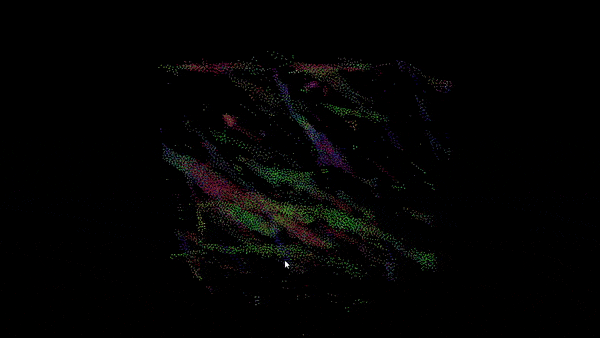
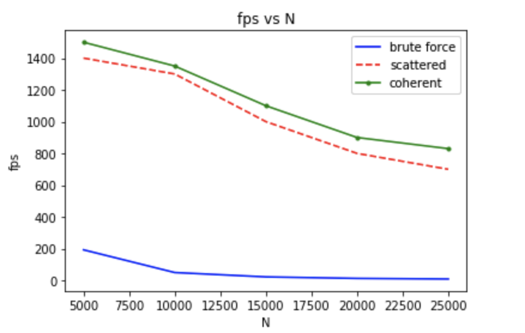
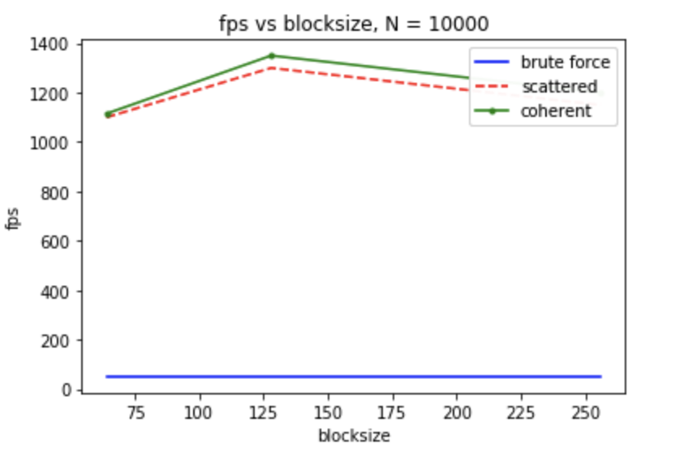

**University of Pennsylvania, CIS 565: GPU Programming and Architecture,
Project 1 - Flocking**

* Yu Sun
* [LinkedIn](https://www.linkedin.com/in/yusun3/)
* Tested on: Windows 10 , i7-6700HQ CPU @ 2.60GHz × 8 , GeForce GTX 960M/PCIe/SSE2, 7.7GB Memory (Personal Laptop)

Below is a demo run of the flocking algorithm @ 10000 boids and 128 as the blocksize

The main algorithm behind is fairly straight-forward, the crowd of boids will follow three rules:
* The boids should move toward the perceived center of mass of other boids around
* The boids will move in the direction of the perceived average movement of other boids around
* The boids will keep some distance between each other and other groups

## Performance Analysis (Number of Bloids)
There are three implements done in this project, the naive solution checks for all the other boid in the system so one can
easily tell this is an O(N^2) algorithm, and not utilizing much of GPU's computation power. The second solution separate the 
searching areas into grids and check for only the neighoring grid where there might be influence. The third solution place the 
index in order to eliminate the additional indirection for pointer lookup. Below shows an analysis of how these three approaches 
perform with different number of bloids in the simulation.

One can easily tell the performance gain while avoiding the naive approach. This is because the check can now be done in parallel and finished much faster
by the GPU. While for the naive solutions, every thread have to do the same computation and wait for others to finish. Generally speaking, the coherent approach 
perform better than the scatter one, this is expected because by sorting the index essentially each thread has more likelyhood of accessing continuous blocks of
memory and utilizing caches. As I would expect if I changed to code to check a 27-cell neighborhood the gain of coherent approach is even more obvious since there 
are more memory locations that needs to be accessed, which are in general scattered in different places while using the scattered approach.

Also if the number of bloids keep growing, the naive approach would fail quickly because of the way it depletes the hardware capabilities of the GPU.

## Performance Analysis (Block Size)

Another question that would be interesting to ask is how changing the blocksize would affect the computation performance. Below shows how blocksize changes 
affect the overall performance. 

One needs to do some experiments when selecting the optimal blocksize because different code and hardware would lead to different optimal blocksizes. On my laptop I found that the performance first increase and then decrease with increasing number of blocksize. If the blocksize is too small, the gain of parallel computation(number of active blocks) is not maximized, while if the blocksize is too big the processor won't have enough resources to handle that many threads.

## Performance Anaylsis (Cell Size)
By changing the number of neighbors checked from 8 to 27 with 10000 boids and 128 block size, the fps is reduced from 1300 to 450 for scattered approach, 
and 1350 to 900 for coherent approach. The lowered performance is expected as you need to check more neighbours and therefore you need to do more memory accesses. 
However, notice that the number of neighbors being check is tripled while the performance for coherent approach is not even cut off by half. This is because neighoring 
cell checks still means there is large probability that the content would be located in the shared memory so the lookup can be quick. Depending on the radius that
the programmer set the algorithm to check and how the memory are accessed. Increasing number of neighbors to check doesn't necessarily means the performance would 
reduce a lot.

